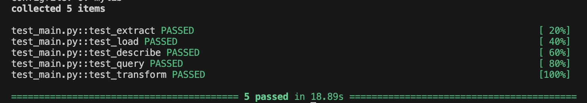
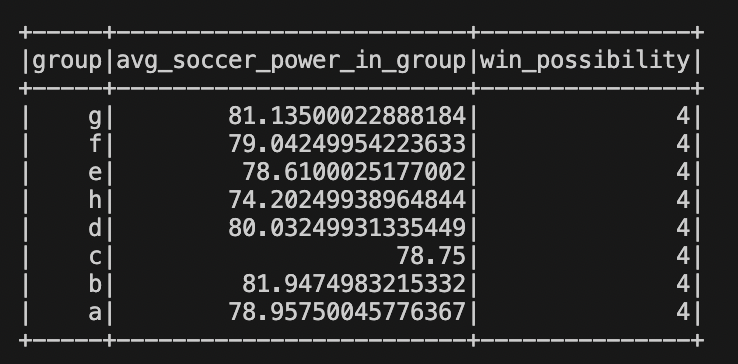
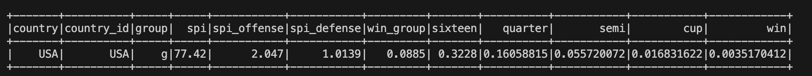

# Haochong-week10-mini-repo [](https://github.com/nogibjj/Haochong-week10/actions/workflows/cicd.yml)
This is a repo template for course 706_Data_Engineering Week 10 Mini Project. I use a datset about the prediction of the world cup. First of all, I define functions called `extract` to get data from url. Then, use `load` to load data. After that, I use `describe` to show the basic information of my dataset. Then, I create afunction called `group_win_prob_query` and `transform` to fulfill our requirement. Consequently, I use `main.py` to use my function in `lib.py`, and use `test_main.py` to test my `main.py`. Finally, I use Action to run `Makefile` and got a 100% pass. 

Important files:
* `lib.py`
* `main.py`
* `dataset`
* `test_main.py`

# Purpose
- Use PySpark to perform data processing on a large dataset
- Include at least one Spark SQL query and one data transformation


## Preparation 
1. Open codespaces and vscode
2. Wait for container to be built with requiremnts.txt installed


## Check format and test errors
1. Format code with Python black by using `make format`

2. Lint code with Ruff by using `make lint`. 

3. Test code by using `make test`



### Query and Result:
Here is my query:

```
SELECT group, 
                               AVG(spi) AS avg_soccer_power_in_group, 
                               COUNT(win) AS win_possibility 
                               FROM world_cup_data 
                               GROUP BY group
```
* Explanation:
The purpose is to find out each group's possibility to win the cup base on the prediction of Jun.9th. Hence, I group them by the group of world cup, sum the possibility of win for all teams in the group and ordered by the possibility of Jun.9th.

* Expected result:



### Transformation and Result:
Here is my transformation:

```
df.filter(df["country"] == "USA")
```

* Explanation:
The purpose is to practice the `filter` transformation to filter the dataset to include only row where the `country` is "USA".

* Expected result:



## References


